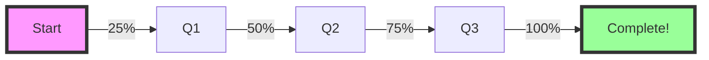
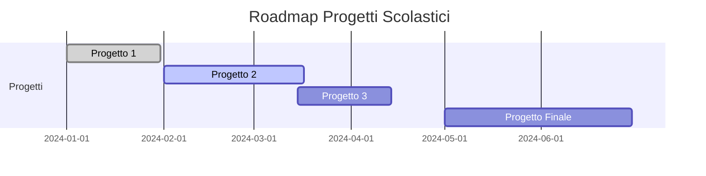

# 🎮 Repository Scolastica 🎮

<div align="center">


</div>

---

<div align="center">
  
[](https://github.com/TUO-USERNAME/TUA-REPO/stargazers)
[](https://github.com/TUO-USERNAME/TUA-REPO/network/members)


</div>

## 📊 Statistiche del Progetto

<div align="center">
  


</div>

## 🎯 About This Repository

<div align="center">

</div>

> 💭 *"Il codice è poesia in movimento"*

Questa repository contiene i miei progetti scolastici per il corso di **[NOME MATERIA]**.

### 🚀 Quick Stats

<div align="center">

| 📁 Progetti | ⭐ Completati | 🔧 In Progress | 📅 Ultimo Update |
|:-----------:|:------------:|:--------------:|:----------------:|
| **10**      | **7**        | **3**          | **Oggi**         |

</div>

## 🎮 Tech Stack

<div align="center">


</div>

## 📂 Struttura Repository

```ascii
📦 Repository-Scolastica
 ┣ 📂 Progetto-1
 ┃ ┣ 📜 main.py
 ┃ ┗ 📜 README.md
 ┣ 📂 Progetto-2
 ┃ ┣ 📜 index.html
 ┃ ┣ 📜 style.css
 ┃ ┗ 📜 script.js
 ┣ 📂 Progetto-3
 ┃ ┗ 📜 app.java
 ┗ 📜 README.md
```

## 🎨 Progetti Principali

<details>
<summary>🔥 Progetto 1: Calculator App</summary>

### 📐 Calcolatrice Scientifica
- **Linguaggio:** Python
- **Status:** ✅ Completato
- **Voto:** 10/10

```python
# Preview del codice
def calculate(a, b, operation):
    return eval(f"{a} {operation} {b}")
```


</details>

<details>
<summary>⚡ Progetto 2: Website Portfolio</summary>

### 🌐 Portfolio Personale
- **Linguaggio:** HTML/CSS/JS
- **Status:** 🔄 In Progress
- **Completamento:** 75%


</details>

<details>
<summary>🚀 Progetto 3: Game Development</summary>

### 🎮 Snake Game
- **Linguaggio:** JavaScript
- **Status:** ✅ Completato
- **Features:** 
  - Multiplayer
  - Leaderboard
  - Power-ups


</details>

## 📈 Progress Tracker

<div align="center">

### 🏆 Obiettivi del Semestre

- [x] Completare 5 progetti
- [x] Imparare un nuovo linguaggio
- [ ] Contribuire a progetti open source
- [ ] Creare un'app mobile
- [ ] Partecipare ad un hackathon

### 📊 Grafico Progressi



</div>

## 🎯 Skills & Learning

<div align="center">

| Skill | Livello | Progress Bar |
|-------|---------|--------------|
| Python | Advanced | ████████░░ 80% |
| JavaScript | Intermediate | ██████░░░░ 60% |
| Java | Beginner | ████░░░░░░ 40% |
| Git | Intermediate | ███████░░░ 70% |
| Problem Solving | Advanced | █████████░ 90% |

</div>

## 🌟 Featured Code Snippet

```python
# 🎨 ASCII Art Generator
def create_pixel_art():
    art = """
    ╔═══════════════════╗
    ║  ▄▄▄▄▄▄▄▄▄▄▄▄▄▄▄  ║
    ║  █ ● ══════ ● █  ║
    ║  █ ║ CODING ║ █  ║
    ║  █ ║  TIME  ║ █  ║
    ║  █ ● ══════ ● █  ║
    ║  ▀▀▀▀▀▀▀▀▀▀▀▀▀▀▀  ║
    ╚═══════════════════╝
    """
    return art
```

## 🎮 Mini Game (Click to Play!)

<div align="center">

[](https://playsnake.org/)
[](https://tetris.com/play-tetris)

</div>

## 📅 Timeline



## 🤝 Collaboratori

<div align="center">

| Avatar | Nome | Ruolo | GitHub |
|--------|------|-------|--------|
| 👨‍💻 | Tu | Developer | [@tuousername](https://github.com) |
| 👩‍💻 | Collaboratore 1 | Frontend | [@username1](https://github.com) |
| 👨‍💻 | Collaboratore 2 | Backend | [@username2](https://github.com) |

</div>

## 💬 Contact & Social

<div align="center">

[](https://discord.gg/)
[](https://instagram.com/)
[](https://linkedin.com/)
[](mailto:tua.email@gmail.com)

</div>

## 🎨 Random Dev Quote

<div align="center">


</div>

## 🏆 Achievements

<div align="center">


</div>

---

<div align="center">

### 🎮 Retro Counter


### 💫 Thanks for visiting!

 
**Happy Coding!**


</div>

<!-- 
ASCII Art Bonus:

    ╔══════════════════════════════════════════╗
    ║                                          ║
    ║    ██████╗ ███████╗ █████╗ ██████╗     ║
    ║    ██╔══██╗██╔════╝██╔══██╗██╔══██╗    ║
    ║    ██████╔╝█████╗  ███████║██║  ██║    ║
    ║    ██╔══██╗██╔══╝  ██╔══██║██║  ██║    ║
    ║    ██║  ██║███████╗██║  ██║██████╔╝    ║
    ║    ╚═╝  ╚═╝╚══════╝╚═╝  ╚═╝╚═════╝     ║
    ║                                          ║
    ║         ███╗   ███╗███████╗             ║
    ║         ████╗ ████║██╔════╝             ║
    ║         ██╔████╔██║█████╗               ║
    ║         ██║╚██╔╝██║██╔══╝               ║
    ║         ██║ ╚═╝ ██║███████╗             ║
    ║         ╚═╝     ╚═╝╚══════╝             ║
    ║                                          ║
    ╚══════════════════════════════════════════╝
-->
