```mermaid
graph TD
    A[📁 Repository] --> B[📂 Algorithms]
    A --> C[📂 Web Development]
    A --> D[📂 Database]
    A --> E[📂 Mobile Apps]
    
    B --> B1[🐍 sorting.py]
    B --> B2[🐍 searching.py]
    
    C --> C1[⚛️ Portfolio]
    C --> C2[🌐 Blog]
    
    D --> D1[📊 Library System]
    
    E --> E1[📱 Task Manager]
    
    style A fill:#1a1b27,stroke:#70a5fd,stroke-width:3px,color:#fff
    style B fill:#2d2e3f,stroke:#bf91f3,stroke-width:2px,color:#fff
    style C fill:#2d2e3f,stroke:#bf91f3,stroke-width:2px,color:#fff
    style D fill:#2d2e3f,stroke:#bf91f3,stroke-width:2px,color:#fff
    style E fill:#2d2e3f,stroke:#bf91f3,stroke-width:2px,color:#fff
```

<div align="center">


<br>


<br>

<div>
  
  
  
</div>

<br>


</div>

<br>

##  **About This Repository**


```javascript
const repository = {
    tipo: "Educational Projects",
    anno: "2024",
    status: "🚀 Active Development",
    obiettivo: "Learning by Doing",
    passione: "∞"
};
```

> *"Il codice è poesia che le macchine possono eseguire"*

Una collezione curata dei miei progetti accademici, dove ogni cartella rappresenta un passo nel mio percorso di apprendimento.

<br clear="right"/>

---

##  **Repository Stats**

<div align="center">

<table>
<tr>
<td width="50%">


</td>
<td width="50%">


</td>
</tr>
</table>

### 📊 **Project Overview**


</div>

---

##  **Tech Stack**

<div align="center">


<br><br>


</div>

---

##  **Featured Projects**

<div align="center">

<table>
<tr>
<td width="50%" align="center">
<br>
<a href="https://github.com/TUO-USERNAME/calculator">

</a>
<br><br>
<b>🧮 Calcolatrice Scientifica</b>
<br>


<br>
<i>GUI application with advanced functions</i>
</td>
<td width="50%" align="center">
<br>
<a href="https://github.com/TUO-USERNAME/portfolio">

</a>
<br><br>
<b>🌐 Portfolio Website</b>
<br>


<br>
<i>Responsive personal portfolio</i>
</td>
</tr>
<tr>
<td width="50%" align="center">
<br>
<a href="https://github.com/TUO-USERNAME/database">

</a>
<br><br>
<b>📚 Library Management</b>
<br>


<br>
<i>CRUD system for library</i>
</td>
<td width="50%" align="center">
<br>
<a href="https://github.com/TUO-USERNAME/algorithms">

</a>
<br><br>
<b>⚡ Sorting Algorithms</b>
<br>


<br>
<i>Implementation & comparison</i>
</td>
</tr>
</table>

</div>

---

##  **Project Structure**



---

##  **Learning Journey**

<div align="center">


</div>

---

##  **Connect With Me**

<div align="center">

<a href="https://github.com/TUO-USERNAME">
  
</a>
<a href="https://linkedin.com/in/tuoprofilo">
  
</a>
<a href="mailto:tua.email@example.com">
  
</a>
<a href="https://discord.com">
  
</a>

<br><br>


<br>

###  Thanks for visiting!


<br>


<br>


</div>
